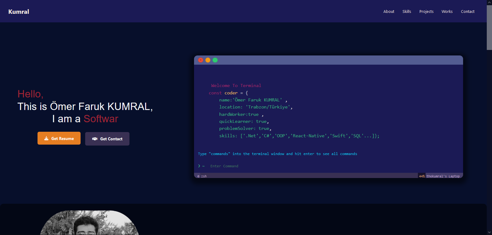
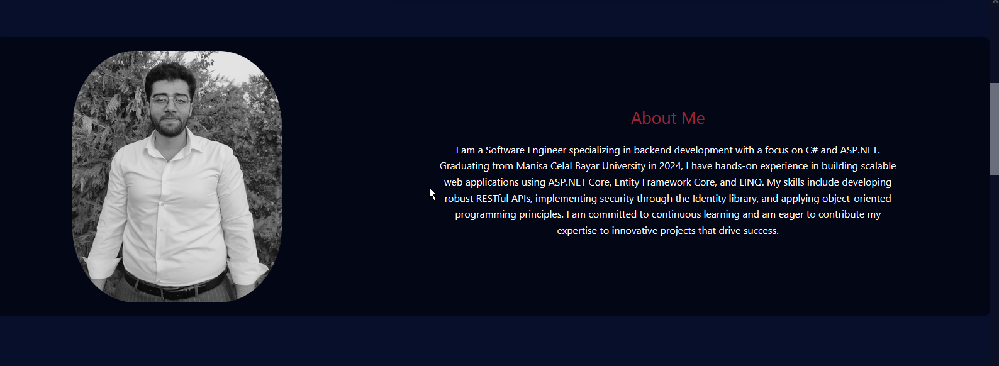
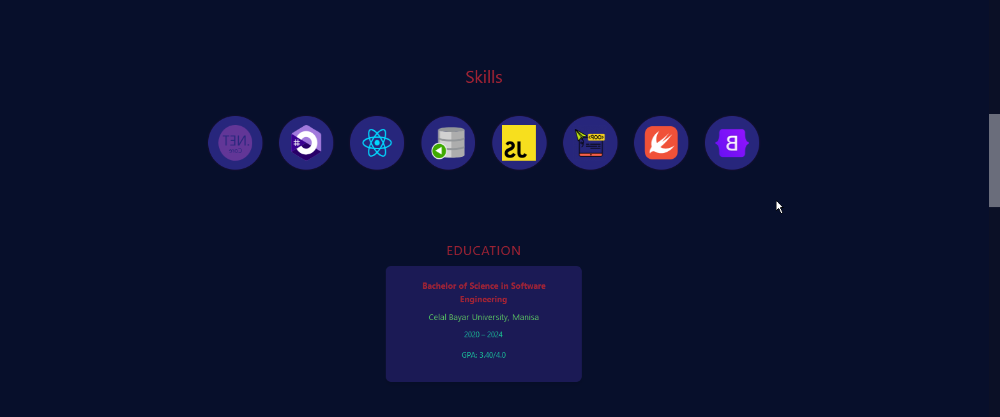
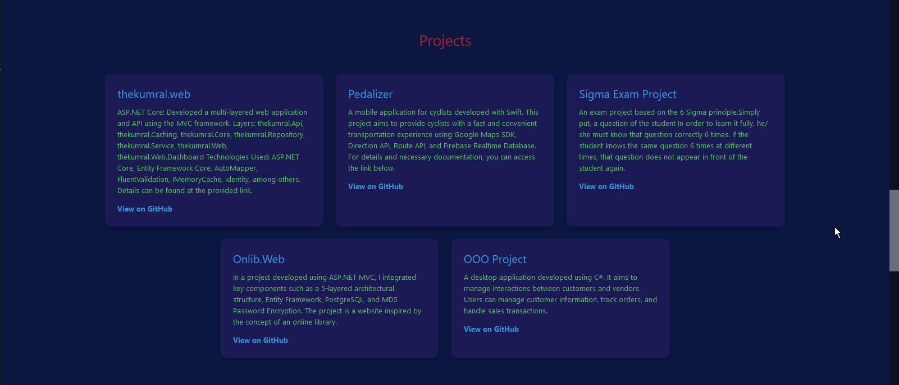
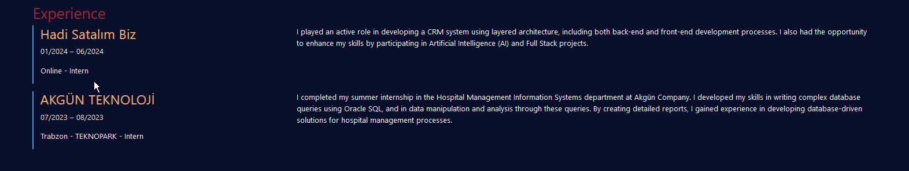

# Ömer Faruk KUMRAL's Portfolio

Welcome to my portfolio! This project showcases my skills and experiences in software engineering, particularly focusing on backend development using C# and ASP.NET technologies. Below are screenshots that highlight the design and functionality of my portfolio website.

## Screenshots
<table>
  <tr>
    <td></td>
    </tr> <tr>
    <td></td>
      </tr>  <tr>
    <td></td>
     <tr>
          <td></td>
     </tr><tr>
    <td></td>
     </tr><tr> 
    <td></td>
  
    
  </tr>
</table>
## Project Overview

This portfolio is built using GitHub Pages, and it highlights my journey as a Software Engineer, with sections detailing my education, skills, projects, and contact information. The website is responsive and designed to provide an engaging user experience across various devices.

## How to View the Portfolio

You can view my live portfolio at [GitHub Pages](https://thekumral.github.io/).
