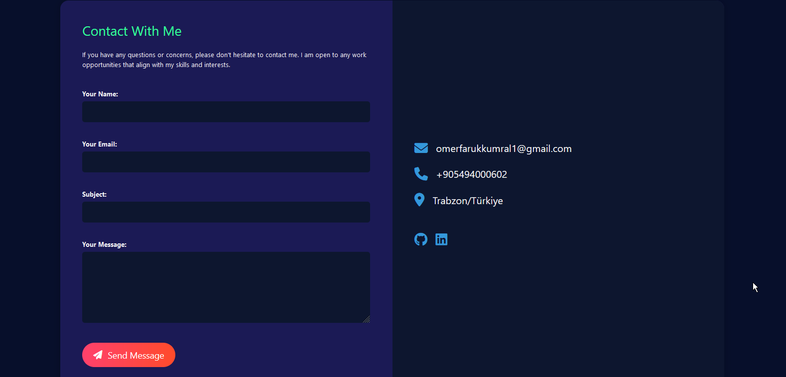

# Ömer Faruk KUMRAL's Portfolio

Welcome to my portfolio! This project showcases my skills and experiences in software engineering, particularly focusing on backend development using C# and ASP.NET technologies. Below are screenshots that highlight the design and functionality of my portfolio website.

## Screenshots

| Screenshot               | Description               |
|--------------------------|---------------------------|
|  | **First Screenshot**: Overview of the homepage layout. |
|  | **Second Screenshot**: Detailed view of the "About Me" section. |
|  | **Third Screenshot**: Showcase of the projects section. |
|  | **Fourth Screenshot**: Display of the skills and technologies. |
|  | **Fifth Screenshot**: Contact form and footer section. |
|  | **Sixth Screenshot**: Responsive design preview on mobile devices. |

## Project Overview

This portfolio is built using GitHub Pages, and it highlights my journey as a Software Engineer, with sections detailing my education, skills, projects, and contact information. The website is responsive and designed to provide an engaging user experience across various devices.

### Features

- **Responsive Design**: Optimized for both desktop and mobile viewing.
- **Interactive Sections**: Includes dynamic elements that enhance user interaction.
- **Clean and Professional Layout**: Showcases my work and experience clearly and effectively.

## How to View the Portfolio

You can view my live portfolio at [GitHub Pages](https://github.com/thekumral/your-portfolio-link).
